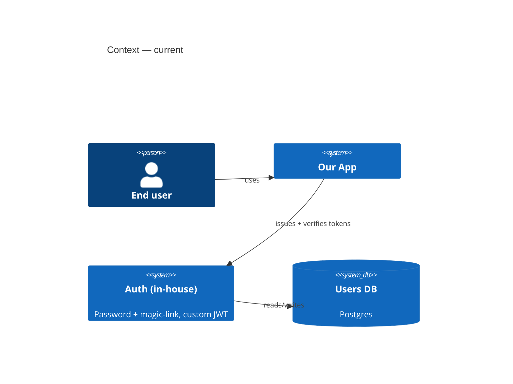
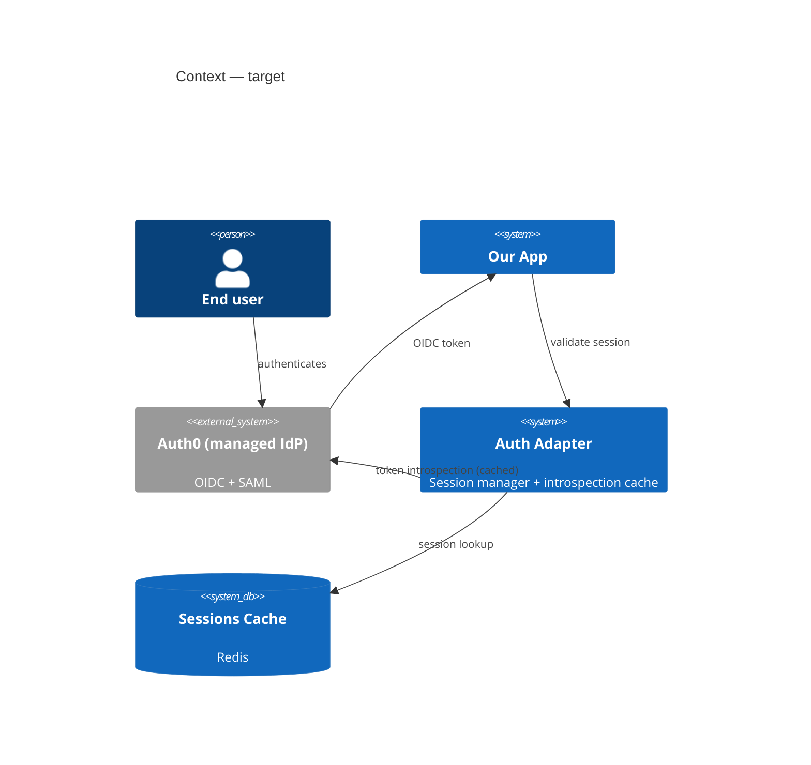
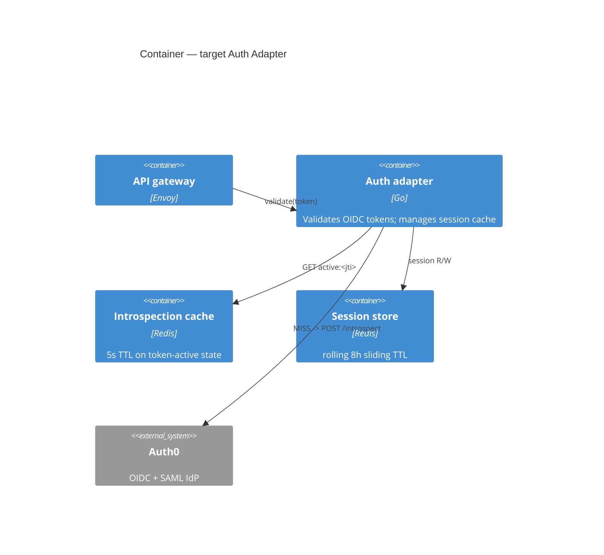

# ARD-014 — Auth Service Evolution to Federated Identity

> Scope: Architecture Evolution (Step 4 routing)
> In scope: identity provider, session model, token shape, downstream service trust
> Out of scope: UI flows (separate PRD), hosted-auth UI choice (covered in ADR-015)
> Templates used: `assets/c4-mermaid-template.md`, `assets/adr-template.md`, `assets/nfr-template.md`
> Status: Proposed | Date: 2026-04-26 | Author: solution-architect

## Context

Current auth service issues local JWTs from a custom user table; supports password + magic-link only. Three pressures forced the evolution:
1. SSO required by 4 enterprise prospects (compliance).
2. Token revocation latency (JWT-only) at 8h is unacceptable for one regulated buyer.
3. Maintenance burden of rolling our own identity primitives.

## C4 — Context (current vs target)

## C4 — Container (target)

## ADR-014.A — Pick the IdP

| Section | Content |
|---|---|
| Status | Accepted |
| Date | 2026-04-26 |
| Context | Need OIDC + SAML, enterprise SSO, audit-log export, SCIM provisioning. In-house option dropped per maintenance pressure (see ARD context). |
| Decision | Adopt Auth0 (Okta-owned) as managed IdP. |
| Alternatives | (1) Keycloak self-host, (2) AWS Cognito, (3) Stay in-house |
| Consequences (positive) | Compliance certifications inherited; SCIM + SSO ship in <2 weeks |
| Consequences (negative) | Vendor lock-in moderate; cost grows with MAU at $0.07/user/month; egress dependency |
| Reversibility | Medium — OIDC is portable; session store + adapter are ours |

### Alternatives matrix

| Criterion | Auth0 | Keycloak | Cognito | In-house |
|---|---|---|---|---|
| Setup time | 2w | 6w | 4w | already |
| SCIM provisioning | included | manual | partial | none |
| SOC2 inherited | yes | self | yes | no |
| Vendor lock-in | medium | low | high | none |
| 10k MAU cost / month | ~$700 | ~$200 (ops) | ~$550 | $0 + heavy maint |
| Reject reason | (chosen) | ops burden too high | AWS-only lock-in | maintenance burden was the trigger |

## ADR-014.B — Token revocation strategy

| Section | Content |
|---|---|
| Status | Accepted |
| Context | 8h revocation latency unacceptable for regulated buyer. |
| Decision | Hybrid: short-lived JWT (5m) + introspection-on-validate with Redis cache (5s TTL) on cache miss. Revocation propagation worst-case 5s. |
| Alternatives | Pure introspection (no cache) — too costly; pure JWT (no revoke) — fails the requirement. |
| Consequences | Adds 1 cache hop per request (p50 +2ms); revocation latency moves 8h to 5s. |
| Reversibility | High — if introspection cost too high, raise TTL or fall back to JWT-only for non-regulated tenants. |

## NFRs (quantified per `assets/nfr-template.md`)

| NFR | Target | Measurement | Why |
|---|---|---|---|
| Auth validation latency p99 | <= 8ms | Prometheus `auth_validate_duration_seconds` | Sits in every request path; budget 4% of 200ms p99 SLO |
| Revocation propagation p99 | <= 5s | Synthetic check (revoke -> measure access denial) | Regulated buyer requirement |
| IdP availability | >= 99.95% / month | IdP status page + synthetic uptime probe | One nine above app SLO since auth gates everything |
| Session-store p99 read | <= 2ms | Redis SLOWLOG + Prom histogram | To meet auth p99 budget |
| Sustained throughput | 8,000 validations / sec | Load test before cutover | 2× current peak |

## Tradeoff Transparency

We rejected pure-introspection (~38ms p99 added per request) because it breaks the auth-validation NFR. We rejected JWT-only because it violates the revocation NFR. The hybrid we chose costs +2ms p99 — within budget — and meets revocation latency. Tradeoff matrix above documents why each alternative was rejected per criterion.

## Migration Plan (pointer — full plan in MIGRATE-014)

Strangler-fig over 6 weeks. New tenants on Auth0 from week 1; existing tenants migrate in waves of 10% / week. Dual-validation window 6 weeks (accept both old custom-JWT AND new OIDC). See `MIGRATE-014.md` for the migrate-pack.

## Risks

| Risk | P x I | Mitigation |
|---|---|---|
| Auth0 outage = our outage | L x H | Introspection cache absorbs short outages (5m JWT TTL); document 1h-degraded mode |
| Cost surprise on MAU growth | M x M | Quarterly cost review; alert at 80% of budget |
| Tenant migration friction | M x M | Dual-validation window; opt-in ahead of forced migration |

## Open Questions

- Do we want tenant-specific IdP shards for the EU residency requirement? Open with platform-pm.
- Should the session store be regional or global? Pending capacity test.
