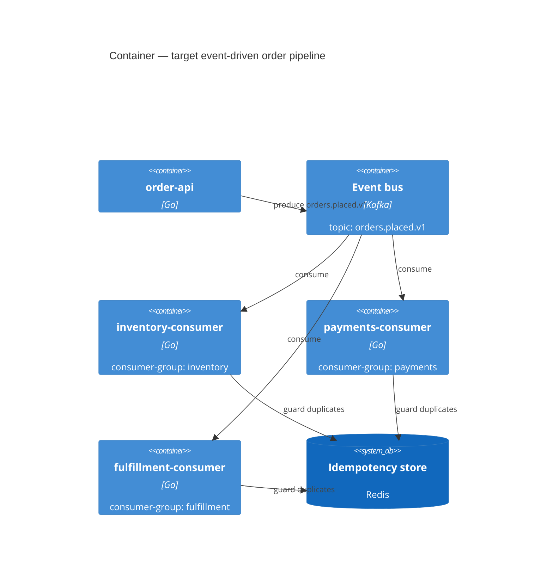

# ARD-022 — Synchronous Order Pipeline to Event-Driven (Strangler-fig Migration)

> Scope: Architecture Evolution
> In scope: order-pipeline messaging substrate, ordering guarantees, idempotency
> Out of scope: payment-pipeline migration (separate ARD), retention policy on event log (deferred to ADR-022.D)
> Templates used: `assets/c4-mermaid-template.md`, `assets/adr-template.md`, `assets/nfr-template.md`, `assets/gap-analysis-template.md`
> Status: Proposed | Date: 2026-04-27 | Author: solution-architect

## Context

Current order pipeline is a synchronous chain: `order-api -> inventory -> payments -> fulfillment` over HTTP/JSON. Three pain points: (1) p99 order placement is 4.8s due to chain latency, (2) any one downstream outage fails the whole order, (3) replaying historical orders for analytics is impractical (no event log).

We will not big-bang this. Strangler-fig migration: emit events alongside the synchronous chain first, then peel off downstreams to event-consumer mode one by one.

## C4 — Container (target end-state)

## ADR-022.A — Messaging substrate choice

| Section | Content |
|---|---|
| Status | Accepted |
| Date | 2026-04-27 |
| Context | Need: per-order ordering, replay, multi-consumer fan-out, retention >= 7 days. Volume: 8k orders / hour peak, 30M orders / month. |
| Decision | Apache Kafka (managed via Confluent Cloud). |
| Alternatives | RabbitMQ (with Streams), AWS SQS+SNS, NATS JetStream, Google Pub/Sub |
| Consequences | Replay capability gained; p99 producer latency 6ms (measured in spike `spike-2026-04-15-kafka/`). Operational complexity rises; client library footprint moderate. |
| Reversibility | Low-medium — once consumers depend on Kafka semantics (compaction, partitions), porting is non-trivial. |

### Alternatives matrix

| Criterion | Kafka | RabbitMQ Streams | SQS+SNS | NATS JetStream | Pub/Sub |
|---|---|---|---|---|---|
| Per-key ordering | yes (partition) | yes | no (FIFO is per-group only) | yes | per-key in Pub/Sub Lite |
| Replay window | 7d-30d standard | 7d configured | 14d max | 30d | 7d default |
| Throughput at our peak | 100x headroom | 30x | 10x | 50x | 50x |
| Team experience | medium | high | medium | low | low |
| Managed offering | yes (Confluent) | yes (CloudAMQP) | yes (AWS) | yes (Synadia) | yes (GCP) |
| Reject reason | (chosen) | replay weaker; ecosystem narrower for stream processing | no per-key ordering across topics | team learning curve | regional lock-in |

## ADR-022.B — Ordering + idempotency

| Section | Content |
|---|---|
| Status | Accepted |
| Decision | Per-customer-id partition key for `orders.placed.v1`; consumers idempotent via Redis `seen:<event-id>` (24h TTL). |
| Alternatives | Global ordering (rejected: single partition kills throughput); transactional outbox pattern at producer (deferred — adopt if duplicate rate observed > 0.01%). |
| Consequences | Ordering guaranteed per customer; cross-customer ordering is best-effort. Duplicates handled at consumer; producer-side outbox can be added later non-disruptively. |
| Reversibility | High — partition key change is an operational migration. |

## ADR-022.C — Migration approach (Strangler-fig)

| Section | Content |
|---|---|
| Status | Accepted |
| Decision | Phase 1: produce events alongside synchronous chain (dual-write). Phase 2: switch one consumer at a time from HTTP to Kafka, retaining HTTP fallback. Phase 3: remove HTTP path per consumer once 30 days at 0 fallback events. |
| Alternatives | Big-bang cutover (rejected: blast radius too large). Reverse-strangler (consumers first, producers last) — rejected because dual-read at producer is more complex than dual-write. |
| Consequences | 3-month migration timeline; dual-write cost period. |
| Reversibility | Per phase; full rollback at any phase by toggling feature flag. |

## NFRs

| NFR | Target | Measurement |
|---|---|---|
| Producer p99 latency (api -> bus ack) | <= 12ms | Prometheus `kafka_producer_send_duration_seconds` |
| End-to-end p99 (placed -> fulfillment confirmed) | <= 1.2s (was 4.8s sync) | Synthetic order trace |
| Per-key ordering breaches | 0 / month | Audit consumer (offset monotonicity check) |
| Event loss | 0 / month | Reconciliation job vs orders table, daily |
| Bus availability | >= 99.95% / month | Confluent SLA + synthetic probe |
| Consumer lag p99 | <= 30s | `kafka_consumergroup_lag_max` |

## Gap Analysis (per `assets/gap-analysis-template.md`)

| Capability | Current | Target | Gap | Owner |
|---|---|---|---|---|
| Replay last 7d of orders | not possible | one command | full | platform |
| Per-customer ordering | implicit (sync) | partition key | needed | platform |
| Idempotency at consumer | not present | Redis-backed | needed | each consumer team |
| Schema evolution | ad-hoc JSON | Avro + Schema Registry | needed | platform |
| Observability of bus health | none | Confluent metrics + Grafana | needed | platform-sre |

## Tradeoff Transparency

We chose Kafka despite higher operational complexity than RabbitMQ because the replay + per-key ordering combination is load-bearing for two use cases (analytics replay + per-customer ordering) that RabbitMQ's stream variant supports more weakly. We chose strangler-fig over big-bang because order placement is on the critical revenue path; phased migration with feature flags is reversible per phase. Will revisit Kafka choice if Confluent cost > $10k/month or if team operability complaints recur.

## Risks

| Risk | P x I | Mitigation |
|---|---|---|
| Schema-evolution mistakes break consumers | M x H | Schema Registry + backward-compatibility-only allowed via CI gate |
| Consumer-side bug causes duplicate side effects | M x H | Idempotency store (Redis); reconciliation job |
| Kafka outage = order pipeline down | L x H | Phase 1+2 retain HTTP fallback path for 6+ weeks |
| Cost surprise from Kafka retention | M x M | Retention starts at 7d; alert at 80% of budget |

## Open Questions (deferred to ADR-022.D)

- Long-term retention strategy for compliance (7d - 7y); separate ADR.
- Whether to compact `orders.placed.v1` (probably no) vs `orders.state.v1` (yes).
