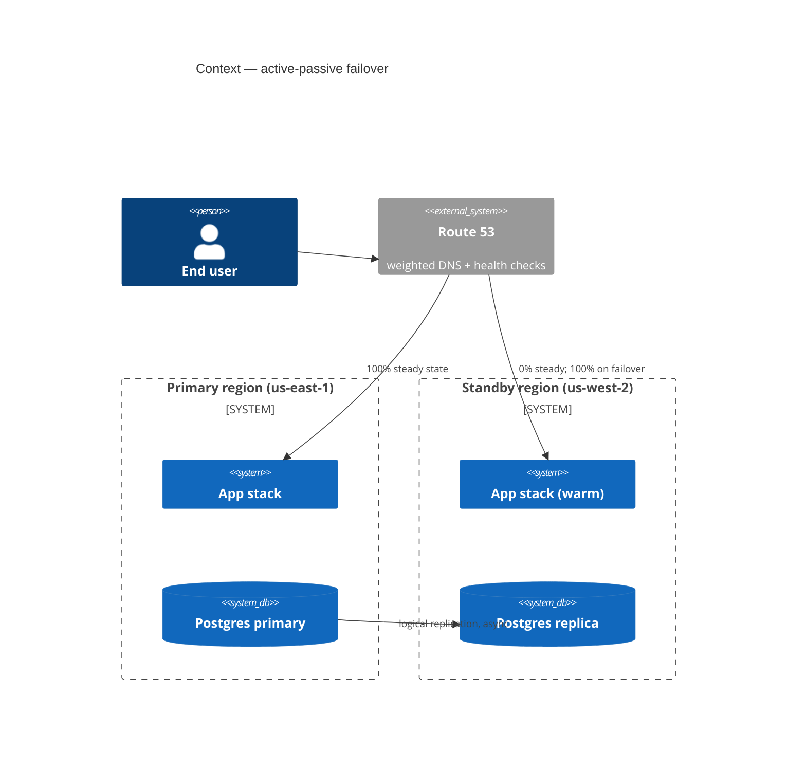
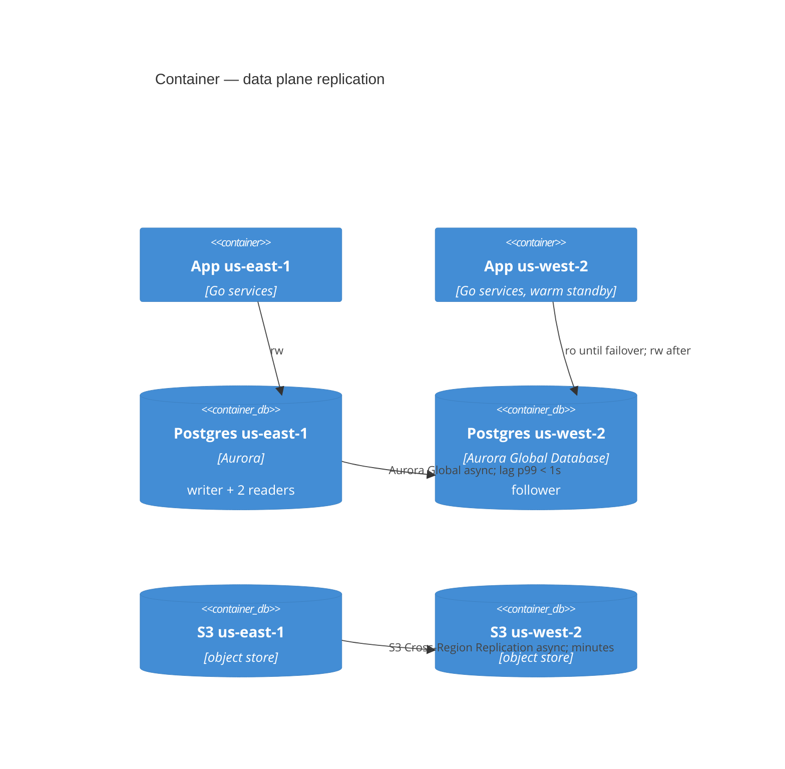

# ARD-031 — Active-Passive Multi-Region Failover

> Scope: Cloud Architecture (Step 4 routing)
> In scope: regional failover topology, RTO/RPO, data replication, traffic routing
> Out of scope: cost-optimization multi-region (separate proposal), edge caching strategy
> Templates used: `assets/c4-mermaid-template.md`, `assets/adr-template.md`, `assets/nfr-template.md`
> Status: Proposed | Date: 2026-04-28 | Author: solution-architect

## Context

Single-region (us-east-1) deployment. April 2026 us-east-1 partial outage (3h) burned 1.4 month of error budget in a single event. Compliance team requires documented multi-region failover for the SOC2 renewal in Q3.

## C4 — Context (target)

## C4 — Container (data plane)

## Dependency Map

| Component | Primary | Standby | Replication | Promotion mechanism |
|---|---|---|---|---|
| App services | us-east-1 ECS | us-west-2 ECS warm | image is regional | ECS scale-out from 0 -> N |
| Postgres | Aurora primary | Aurora Global secondary | async logical | Global DB managed promotion |
| Object storage | S3 us-east-1 | S3 us-west-2 | CRR async | re-point app config |
| DNS | Route 53 | Route 53 | n/a | health-check failover policy |
| Secrets | AWS Secrets Manager | replicated | multi-region replication | n/a |
| Observability | Datadog | Datadog | tenant-level | n/a |

## ADR-031.A — Topology choice

| Section | Content |
|---|---|
| Status | Accepted |
| Decision | Active-passive with warm standby. |
| Alternatives | Active-active multi-region; pilot-light cold standby. |
| Consequences | RTO ~ 8 min (DNS TTL + DB promotion + ECS scale-out); RPO ~ 5s (Aurora Global async lag). Cost: +35% infra over single-region. |
| Reversibility | High — failover topology can be removed by retiring the standby region. |

### Alternatives matrix

| Criterion | Active-active | **Active-passive warm** | Pilot-light cold |
|---|---|---|---|
| RTO | <= 60s | 8 min | 30-60 min |
| RPO | 0 (sync) or seconds (async) | 5s (async) | seconds-minutes |
| Cost vs single | +90% | +35% | +12% |
| Write conflict risk | yes (multi-master) | no | no |
| Operational complexity | high | medium | low |
| Reject reason | conflict resolution + ops complexity not justified at our scale | (chosen) | RTO too long for our SOC2 commitment |

## ADR-031.B — Failover trigger + procedure

| Section | Content |
|---|---|
| Status | Accepted |
| Decision | Manual decision, automated execution. Health-check threshold (3 consecutive failures over 90s on regional load balancer) raises a P1 alert; on-call SRE confirms and triggers the failover runbook. Runbook is fully scripted (no manual kubectl). |
| Alternatives | Fully automatic failover (rejected: false positives more dangerous than the extra 5 min of RTO); fully manual (rejected: scripted execution removes 90% of human-error risk). |
| Consequences | RTO budget: 90s detection + 60s human confirmation + ~6min execution = ~8min. |
| Reversibility | Failback runbook is the inverse procedure; tested quarterly. |

## NFRs

| NFR | Target | Measurement |
|---|---|---|
| RTO (regional outage -> traffic served from standby) | <= 8 min p99 | Quarterly DR drill |
| RPO (data loss at failover) | <= 5s p99 | Aurora Global lag metric |
| Standby data lag (steady state) | <= 1s p99 | `aws_rds_aurora_global_db_replication_lag` |
| Failover drill success rate | >= 95% / year | DR drill log |
| Cost overhead | <= 40% over single-region | Monthly cloud bill diff |

## Tradeoff Transparency

Active-active offers near-zero RTO but introduces multi-master write conflicts; resolving those for our domain (orders + payments) is non-trivial and the wins do not justify the added complexity at our scale. Pilot-light is cheap but the cold-start RTO (30-60 min) violates the SOC2 commitment. Warm standby is the middle path that meets the contractual RTO with reasonable cost. We will revisit if (a) regional outages exceed 1 / quarter or (b) traffic crosses 10k rps sustained.

## Risks

| Risk | P x I | Mitigation |
|---|---|---|
| Replication lag spike at failover -> data loss | M x H | Lag alarm at 30s; do not failover above 30s lag without explicit approval |
| Standby drifts out of sync with primary (config / secrets) | M x H | IaC + multi-region secret replication + drift-check job daily |
| Failover runbook rusts | M x H | Quarterly DR drill; failure of drill blocks next quarter's roadmap |
| Cost overrun on warm standby | L x M | Quarterly cost review |

## Open Questions

- Do we need a third region for active-passive-cold? Defer until 2027.
- Failback automation depth (currently runbook-script; could be one-click). Open with platform-sre.
