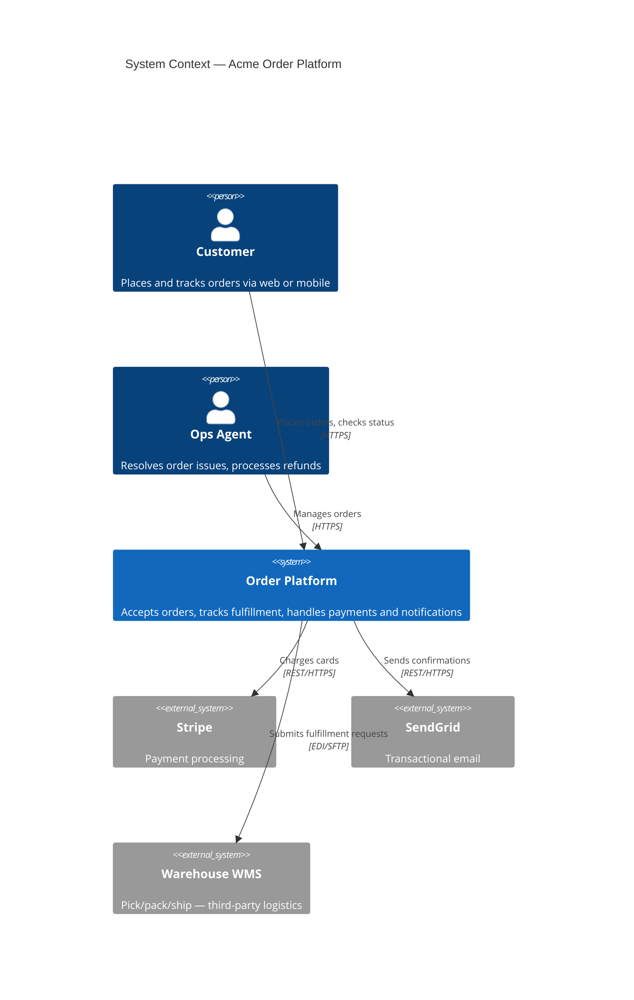
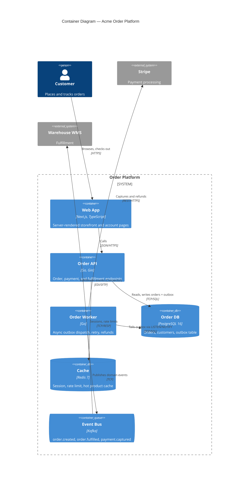

# C4 Diagrams — Mermaid Template

The C4 model (https://c4model.com) describes software architecture at four zoom levels: **Context** (system in its environment with users and external systems), **Container** (high-level deployable units — apps, services, databases), **Component** (modules inside a container), and **Code** (classes, functions). For most architecture documentation the Context and Container levels are sufficient — Component and Code views are produced on demand for areas under active redesign.

The blocks below use Mermaid's native `C4Context` and `C4Container` syntax (Mermaid 8.13+). Render them in any Markdown viewer that ships Mermaid (GitHub, GitLab, Obsidian, Mermaid Live).

## Level 1 — System Context

Shows the system as a single box, surrounded by users and external systems it interacts with. No internal detail.

## Level 2 — Container

Zooms into the system. Each container is something that runs as a separately deployable unit (web app, API, worker, database, cache, queue). Show the major data flows and the protocols.

## Conventions

- One Mermaid block per level — keep them in the same Markdown file under `## Level 1 — System Context`, `## Level 2 — Container`, etc.
- Use `Person`, `System`, `System_Ext`, `Container`, `ContainerDb`, `ContainerQueue` element types — do not invent new shapes.
- Label every `Rel(...)` with a verb + protocol (e.g., `"Reads orders", "JSON/HTTPS"`).
- Keep external systems on the diagram boundary; do not bury them inside the system box.
- For Level 3 (Component) and Level 4 (Code), create separate files named `c4-component-<container>.md` and `c4-code-<component>.md` rather than stacking all four levels in one document.
