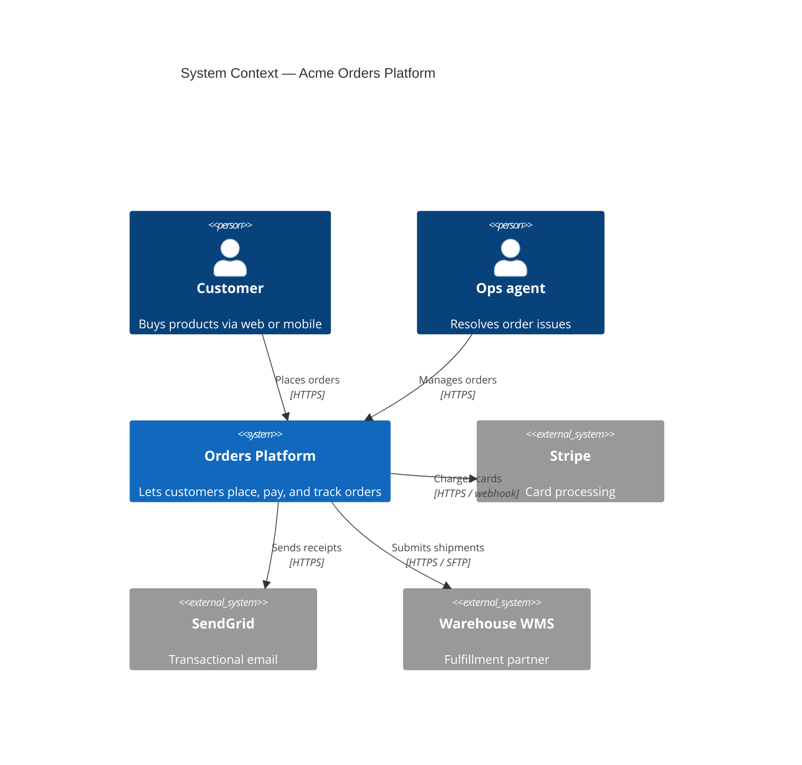
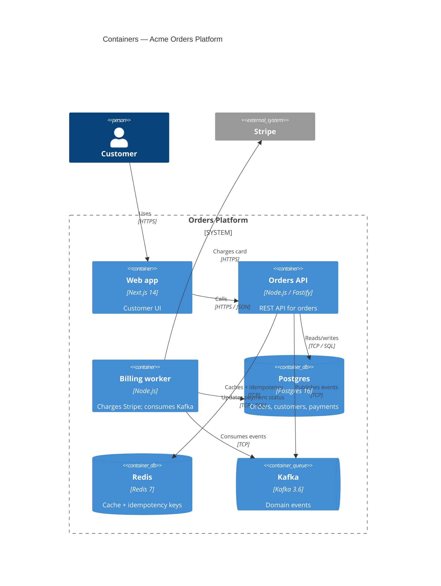
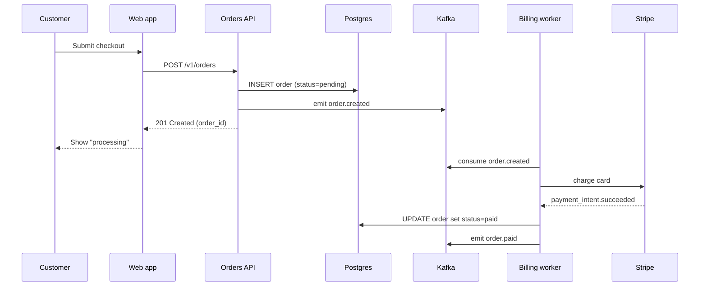
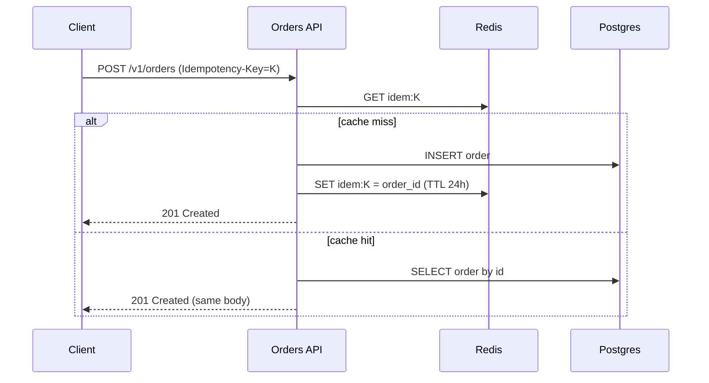
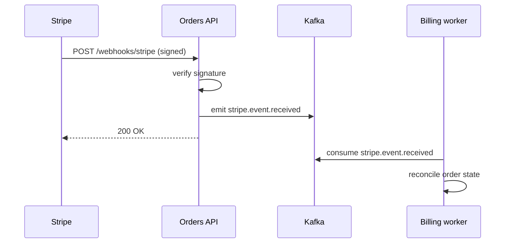
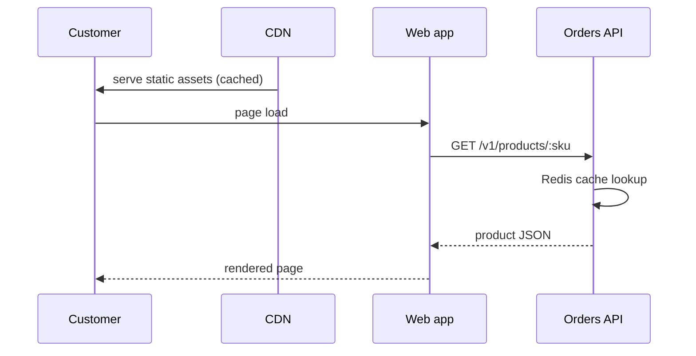
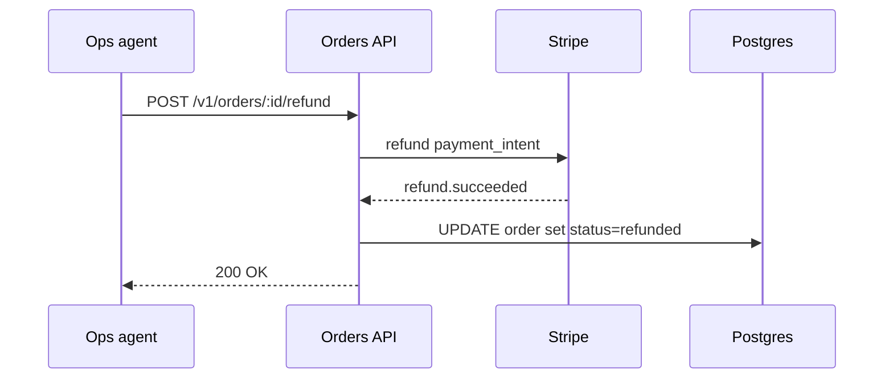

# Architecture — `<system-name>`

> Aligned with the **C4 model** (https://c4model.com). This document
> covers Level 1 (Context), Level 2 (Container), and key dynamic
> flows. Component-level (L3) and code-level (L4) views live next to
> the relevant module READMEs.

## System context (C4 — Level 1)

## Containers (C4 — Level 2)

## Key flows

### Flow 1 — Place an order (happy path)

### Flow 2 — Idempotent retry

### Flow 3 — Stripe webhook (async settlement)

### Flow 4 — Read-heavy product page

### Flow 5 — Refund

## Tech stack

| Layer | Choice | Version | Why |
|---|---|---|---|
| Web app | Next.js | 14 | SSR + edge rendering |
| API | Node.js + Fastify | 20 LTS / 4.x | Low-overhead JSON API |
| Worker | Node.js | 20 LTS | Code-share with API |
| DB | Postgres | 16 | OLTP + JSONB events |
| Cache | Redis | 7 | Idempotency + hot reads |
| Queue | Kafka | 3.6 | Durable event log |
| Container | Kubernetes (EKS) | 1.29 | Standard cloud target |
| Observability | Prometheus + Loki + Tempo | latest | OSS, OTel-native |

## Quality attributes (non-functional requirements)

See [`NFR.md`](./NFR.md). Headlines:

- **Availability:** 99.95% rolling-30d (Tier 1).
- **p99 latency:** 400 ms on `POST /v1/orders`.
- **Durability:** RPO 5 min, RTO 30 min (Postgres PITR + WAL replication).
- **Security:** SOC 2 Type II; OWASP ASVS L2.
- **Privacy:** GDPR/CCPA — PII in Postgres `pii.*` schema, encrypted at rest with KMS.

## Decisions ledger

Architecture Decision Records live under [`adr/`](./adr/). Notable
recent ones:

- [ADR-0007 — Choose Kafka over RabbitMQ](./adr/0007-kafka-over-rabbitmq.md)
- [ADR-0011 — Postgres JSONB for event payloads](./adr/0011-postgres-jsonb.md)
- [ADR-0014 — Idempotency-Key TTL = 24h](./adr/0014-idempotency-ttl.md)

## Risks

| Risk | Likelihood | Impact | Mitigation |
|---|---|---|---|
| Stripe outage blocks payments | Low | High | Queue intent; retry with backoff; ops dashboard |
| Postgres single-AZ failure | Low | High | Multi-AZ replica + automated failover |
| Kafka consumer lag during traffic spike | Medium | Medium | Auto-scale workers on lag metric |
| PII leak via logs | Low | High | Log scrubber; SOC 2 audit + DLP scans |
| Vendor lock-in (EKS-specific features) | Medium | Low | Kept to vanilla K8s primitives where possible |
